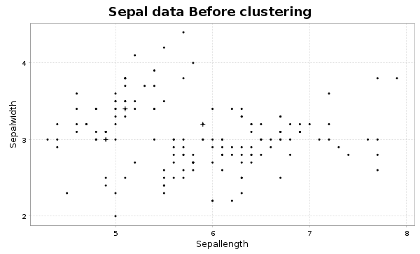
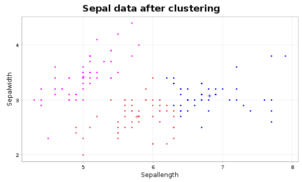

# K-means-Scala

**_Scala_** implementation of **_K-means_** algorithm with **_breeze.Plot_** for the visualisation

## How to run

Once you are in the project directory, open a terminal and run sbt to open a sbt shell sub terminal then run :
```sbt
run main
```

# Output test

### Iris data visualisation before using the algorithm


### Iris data visualisation after using the algorithm

